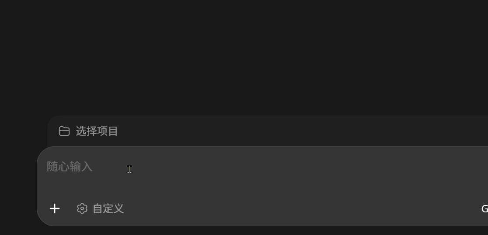
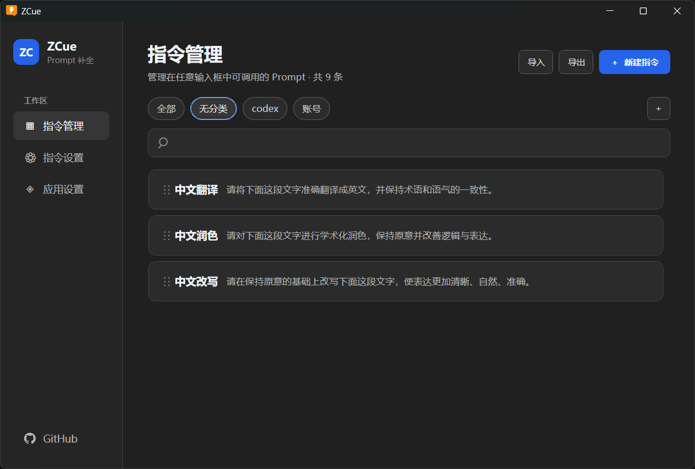
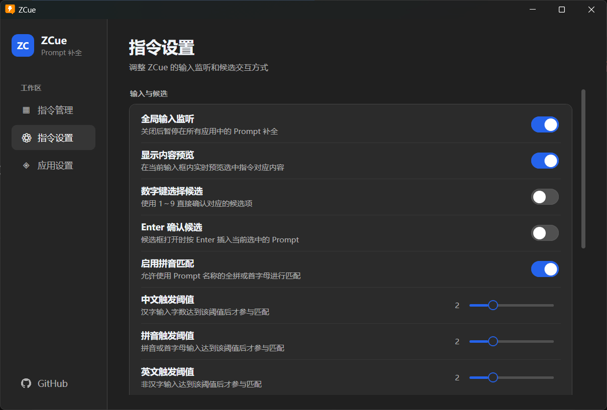

# ZCue

ZCue 是一个面向 Windows 的全局 AI 提示词快捷输入工具。在兼容的文本输入框中输入 Prompt 名称对应的拼音或首字母，即可弹出候选，并通过键盘插入完整提示词。

## 使用场景

ZCue 适合在多个 AI 客户端之间复用较长的提示词，尤其是日常使用 AI 编程助手和多模型客户端的用户。Prompt 内容可以包含多行指令，选中候选后会一次性插入当前输入框。

- **AI 编程助手**：在 Codex、OpenCode 等工具中快速输入代码解释、问题排查、代码审查、重构和提交说明等提示词。
- **多模型对话客户端**：在 Cherry Studio 等客户端中复用角色设定、任务要求、翻译、润色和总结指令。
- **跨应用工作流**：在不同 AI 客户端及其他兼容的文本输入框中使用同一套 Prompt 和拼音快捷触发方式，不必为每个应用单独维护一份快捷短语。

ZCue 的重点是快速复用 AI 提示词；实际可用性取决于目标应用输入框对键盘输入和文本插入的支持情况。

## 功能演示







## 当前 MVP

- .NET 8 + WPF + Win32
- `WH_KEYBOARD_LL` 全局键盘监听
- 最近输入缓冲区与窗口切换重置
- 缩写前缀匹配、名称匹配和基础排序
- 无边框、置顶、不抢焦点候选窗口
- 输入框内置顶、鼠标穿透的 Prompt 幽灵文字预览
- UI Automation → `GetGUIThreadInfo` → 窗口位置的光标定位 fallback
- `↑` / `↓`、数字 `1`～`9`、`Tab`、`Enter`、`Esc`
- 剪贴板保护、Backspace 删除和 Unicode Ctrl+V 注入
- 系统托盘、暂停/启用监听、开机启动菜单
- 指令管理界面：搜索、新增、编辑、删除和启用/禁用
- Prompt 与软件设置保存到当前用户的本地 JSON 配置
- 软件设置：全局监听、内容预览、数字键选择和 Enter 确认
- 根据指令名称生成并保存全拼和首字母隐藏别名，管理界面不再维护缩写字段

首次启动时会将内置示例 Prompt 写入当前用户的本地配置目录；后续可以通过管理器维护自己的指令。

## 运行

需要 Windows 11、.NET 8 SDK 和桌面开发组件：

```powershell
dotnet build ZCue.sln
dotnet run --project ZCue.csproj
```

启动后程序默认驻留系统托盘。在 Notepad 中输入 `zw`，候选窗口应出现；继续输入 `zwrs` 后按 `Tab`，触发字符串会被替换为完整 Prompt。

## 目录

```text
App.xaml(.cs)
Models/
Services/
  AppController.cs
  KeyboardHookService.cs
  InputBufferService.cs
  PromptMatchService.cs
  CaretPositionService.cs
  TextInsertionService.cs
  PromptCatalogService.cs
  PromptStorageService.cs
  AppSettingsService.cs
  PinyinAliasService.cs
Infrastructure/
  NativeMethods.cs
  TrayIconService.cs
Views/
  SuggestionWindow.xaml(.cs)
  GhostPreviewWindow.xaml(.cs)
  PromptManagerWindow.xaml(.cs)
  PromptEditorWindow.xaml(.cs)
ViewModels/
  PromptManagerViewModel.cs
  SettingsViewModel.cs
```

## 已知边界

- 某些自绘控件或高权限窗口无法提供 UI Automation caret，也可能拒绝低权限进程的输入注入；此时会退回窗口位置。
- 幽灵文字使用独立覆盖窗，标准单行文本框中的字体和光标对齐最稳定；复杂自绘控件、特殊多行编辑器可能只能显示近似位置。
- MVP 尚未监听鼠标低级 Hook，也未处理 IME 组合过程，因此光标在同一窗口内鼠标跳转和复杂中文输入法场景会在后续阶段增强。
- 当前使用 JSON 持久化，已支持持久化拼音别名匹配，尚未接入 SQLite 和更复杂的模糊匹配。

## 许可证

本项目采用 MIT 许可证，详见 [LICENSE](LICENSE)。
